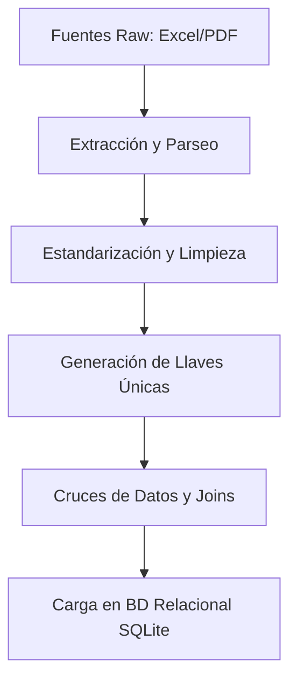

# Guía de Replicación y Documentación Técnica

Esta guía detalla los pasos técnicos, el flujo de procesamiento de datos y las consideraciones operativas necesarias para replicar, ejecutar, desplegar y mantener el sistema **Tree Greenprint - Huella Digital del Árbol**.

---

## 🛠️ Requisitos Previos

Asegúrate de contar con el siguiente software instalado en tu entorno local o de desarrollo:
- **Python 3.10 o superior**
- **Node.js (versión LTS recomendada)**
- **pnpm** (gestor de paquetes para el frontend)
- **Git**
- **Docker** (opcional, recomendado para producción)

---

## 🚀 Replicación Paso a Paso en Local

### 1. Preparación del Backend
1. Abre tu terminal en el directorio raíz del proyecto (`transformagob-osinfor`).
2. Crea un entorno virtual de Python para mantener aisladas las dependencias:
   ```bash
   python -m venv .venv
   ```
3. Activa el entorno virtual:
   - **En Windows (PowerShell):**
     ```powershell
     .venv\Scripts\Activate.ps1
     ```
   - **En macOS/Linux (Bash):**
     ```bash
     source .venv/bin/activate
     ```
4. Instala las dependencias necesarias:
   ```bash
   python -m pip install -r requirements.txt
   ```

### 2. Generación de las Bases de Datos (SQLite)
El sistema utiliza dos bases de datos SQLite que se construyen a partir de fuentes de staging y datos raw:
1. Reconstruye la base de datos de casos heredados (`huella_origen.db`):
   ```bash
   python scripts/build_db.py
   ```
2. Construye el catálogo de trazabilidad ampliado (`huella_catalog.db`) a partir de las fuentes en `raw/`:
   ```bash
   python scripts/build_catalog.py
   ```
   *Nota: Las bases de datos resultantes se crearán en la carpeta `db/` y están excluidas de Git mediante `.gitignore` para evitar redundancias de almacenamiento.*

### 3. Configuración e Inicio del Frontend
1. Navega al directorio del frontend:
   ```bash
   cd frontend
   ```
2. Instala los paquetes y dependencias del proyecto usando `pnpm`:
   ```bash
   pnpm install
   ```
3. Inicia el servidor de desarrollo del frontend:
   ```bash
   pnpm dev
   ```
   La aplicación web estará disponible de manera predeterminada en [http://localhost:5173](http://localhost:5173).

### 4. Inicio del Backend API
1. Regresa al directorio raíz e inicia el servidor de desarrollo FastAPI usando `uvicorn`:
   ```bash
   python -m uvicorn app.main:app --host 127.0.0.1 --port 8000
   ```
2. Puedes verificar el estado de la API visitando:
   - **Salud del backend:** [http://127.0.0.1:8000/health](http://127.0.0.1:8000/health)
   - **Documentación interactiva (Swagger UI):** [http://127.0.0.1:8000/docs](http://127.0.0.1:8000/docs)

---

## 🌐 Estrategia de Despliegue en Producción

Para llevar esta aplicación a producción, se deben considerar las siguientes alternativas de infraestructura:

1. **Servidores Propios (On-Premise) u Hostings Privados:**
   - Permite alojar el backend y el frontend dentro de la red corporativa o centros de datos de la institución (OSINFOR).
   - Requiere configurar servidores web como **Nginx** o **Apache** para servir los archivos estáticos compilados del frontend (`dist/` generado con `pnpm build`) y actuar como proxy inverso para el servidor ASGI (**Uvicorn/Gunicorn**) que corre FastAPI.

2. **Servicios en la Nube (Cloud Computing):**
   - El despliegue se puede realizar contratando servicios en plataformas como **AWS (Amazon Web Services)**, **Microsoft Azure**, **Google Cloud Platform (GCP)** o **DigitalOcean**.
   - Se pueden utilizar servicios administrados de contenedores (e.g., AWS ECS, GCP Cloud Run, Azure Container Apps) o máquinas virtuales independientes (e.g., AWS EC2, GCP Compute Engine).

3. **Uso de Contenedores (Docker):**
   - **Dockerización:** Se recomienda encapsular tanto el backend como el frontend en contenedores Docker independientes. Esto aligera los despliegues, garantiza consistencia entre entornos y facilita el escalado horizontal.
   - **Docker Compose:** Se puede definir un archivo `docker-compose.yml` que orqueste la ejecución de la API de FastAPI, la compilación de estáticos de React con Nginx y configure las bases de datos de forma aislada.

---

## 🔄 Proceso de ETL: Estandarización y Uniones de Datos

> [!IMPORTANT]
> El trabajo de **ETL (Extract, Transform, Load)** es fundamental y obligatorio para el éxito de este proyecto. Debido a que la información proviene de múltiples fuentes heterogéneas, la limpieza, estandarización y correcta unión de los datos es la base del sistema. **No es posible escalar el proyecto si no se consolida un proceso ETL automatizado y confiable.**

### ¿Por qué es crítico?
Los datos forestales originales son capturados en campo por diferentes personas y en diversos formatos (censos en Excel, libros de operaciones en hojas de cálculo y balances finales en documentos PDF firmados). Existen inconsistencias comunes como espacios en blanco adicionales, errores ortográficos en los nombres de las especies, formatos de fecha variados y variaciones en la codificación de árboles y trozas. El ETL resuelve esto mediante la normalización hacia llaves compuestas únicas.

### Paso a Paso de Nuestro Flujo de Migración de Excels a BD Relacional

Para migrar de hojas de cálculo de Excel y PDFs hacia un modelo de base de datos relacional consistente, seguimos este flujo simplificado:



#### Paso 1: Extracción y Parseo (Extract)
Leemos los archivos ubicados en la carpeta `raw/`. Utilizamos librerías especializadas de Python:
- `pandas` y `openpyxl` para extraer y estructurar hojas de cálculo (`.xlsx`).
- `pypdf` para extraer el contenido de texto estructurado de los balances en formato PDF.

#### Paso 2: Estandarización y Limpieza (Transform)
Aplicamos funciones de limpieza a nivel de columna para homogeneizar los datos:
- **Especies:** Traducimos variantes de nombres a un catálogo estándar (ej. convertir `"Brosimum guianense|Manchinga"`, `"Manchinga"`, `"manchinga "` a una denominación única).
- **Formatos:** Convertimos representaciones de fechas a formato estándar ISO (`AAAA-MM-DD`) y cadenas vacías o textos como `"-"` a valores nulos.
- **Volúmenes:** Casteamos los datos a números decimales de alta precisión (`Decimal`) eliminando símbolos de unidades o texto explicativo.

#### Paso 3: Generación de Llaves Únicas Compuestas
Dado que los códigos de los árboles pueden repetirse entre diferentes parcelas o títulos habilitantes, construimos identificadores compuestos únicos para garantizar la integridad de los datos:
- **Llave de Árbol:** `titulo_habilitante` + `parcela_corta` + `codigo_arbol`
- **Llave de Troza:** `titulo_habilitante` + `parcela_corta` + `codigo_troza`
- **Llave de Balance:** `titulo_habilitante` + `parcela_corta` + `especie`

#### Paso 4: Cruces de Datos y Joins (Transform/Join)
Con las llaves únicas generadas, realizamos uniones lógicas entre las diferentes etapas:
1. Cruzamos el **Censo Forestal** con la **Muestra Supervisada** para verificar si la especie y la existencia física coinciden.
2. Unimos los **Libros de Operaciones** (donde se registra la tala y el trozado) con el Censo para asociar cada troza procesada a su árbol de origen.
3. Vinculamos las trozas con las **Guías de Transporte Forestal (GTF)** despachadas para seguir el flujo de volumen físico.
4. Consolidamos el **Balance de Extracción** por especie y parcela, cruzando la suma de volúmenes de las GTF contra el volumen autorizado.

#### Paso 5: Carga en la Base de Datos Relacional (Load)
Finalmente, los datos procesados y relacionados se insertan en tablas estructuradas de SQLite/PostgreSQL. Durante este paso:
- Se activan las restricciones de claves foráneas (`PRAGMA foreign_keys = ON`).
- Se crean índices en las columnas de búsqueda (`search_identifiers`) para asegurar tiempos de respuesta inmediatos (< 50ms) en la API pública.

---

## ⚠️ Restricciones Operativas

Al realizar modificaciones en el código o incorporar nuevos datos, es obligatorio cumplir con las siguientes directrices del negocio:

- **Seguridad en la Base de Datos:** Las consultas ejecutadas por la API hacia SQLite deben ser estrictamente de solo lectura. No se permiten operaciones de escritura/modificación desde la API pública.
- **Privacidad de la Información:** Queda estrictamente prohibido exponer en la interfaz de usuario (UI), respuestas de API o logs públicos datos sensibles como:
  - RUC, DNI, nombres de inspectores, placas vehiculares, coordenadas geográficas exactas, observaciones internas de auditoría o rutas de archivos locales.
- **Terminología y Clasificación:** El sistema **no debe emitir veredictos de legalidad**. No utilices en las proyecciones visuales términos como: *legal, ilegal, aprobado, certificado, fraude*. 
  - En su lugar, utiliza los estados permitidos: `CONSISTENTE`, `POR_REVISAR`, `INCOMPLETO`, `NO_EVALUADO`.
  - Para los controles, utiliza únicamente: `PASS`, `FAIL`, `NOT_EVALUATED`.
- **Campo `R`:** El campo denominado `R` en los esquemas carece de semántica de negocio validada. No debe ser expuesto al público ni debe afectar estados, cálculos de volúmenes o relaciones de linaje.
- **Integridad de Datos:** Un vacío en el origen de datos nunca debe ser mapeado o interpretado como cero (`0`). Mantén el valor vacío original para evitar distorsiones en el flujo.

---

## 💡 Recomendaciones de Desarrollo y Mantenimiento

1. **Uso de Pruebas de Regresión:**
   Antes de realizar cualquier despliegue, ejecuta el conjunto de pruebas unitarias y de humo para asegurar que no se hayan roto los casos estándar:
   ```bash
   # Pruebas unitarias
   python -m unittest discover -s tests -v

   # Pruebas de humo de API y consulta
   python scripts/smoke_api.py
   python scripts/smoke_public_query.py
   python scripts/smoke_catalog_api.py
   ```
2. **Casos de Regresión Críticos:**
   Verifica siempre que los siguientes casos de prueba conserven sus propiedades:
   - **`clean-pc01-501`** (Árbol 501, Parcela PC 01, especie Manchinga): Debe reportar consistencia en los volúmenes (`5.881 -> 5.643 -> 5.192`) y estado `CONSISTENTE`.
   - **`inconsistent-pc01-1170`** (Árbol 1170, Parcela PC 01): Debe detectar el cambio de especie entre censo (Estoraque) y supervisión (Azúcar huayo) y reportar estado `POR_REVISAR`.
3. **Manejo de Volúmenes y Precisión:**
   Si decides ampliar el catálogo de base de datos o modificar la lógica de cálculo, utiliza siempre tipos numéricos de precisión (`Decimal` o equivalentes reales en base de datos) para evitar discrepancias por redondeo decimal.
4. **Extensiones del Catálogo:**
   Si se reciben nuevos datos de origen en la carpeta `raw/`, actualiza el manifiesto correspondiente en `staging/catalog/` y regenera el catálogo usando `scripts/build_catalog.py`.
